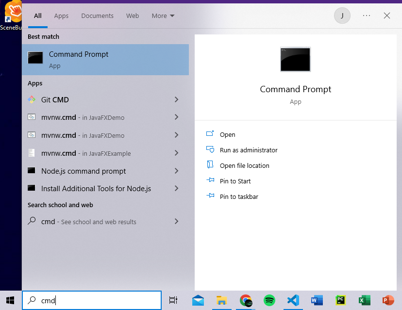

# Getting Started With Git

## Installing Git

Before continuing with the guide, make sure you have git installed.

1. Open a terminal window by navigating to the search bar and typing `cmd`.
   
2. Run the following command to verify you have git installed: `git -v`.  
   

## Creating a Repository

1. First, create a GitHub account by going to https://github.com and signing up. If you already have an account, log in to your account.

2. After logging in, click on the “+” sign in the top right corner of the page and select “New repository” from the dropdown menu.

3. On the “Create a new repository” page, enter a name for your repository in the “Repository name” field. Choose a name that describes what your code does. You can also add a description if you like.

4. Select the repository’s visibility. If you want your code to be public, leave the repository as public. If you want it to be private, select “Private” and then select the owner of the repository.

5. If you want to include a README file, check the box that says “Initialize this repository with a README”. This will create a README file in your repository that you can edit later.

6. Click the “Create repository” button at the bottom of the page.

7. todo<!-- this step is about making a folder -->

8. After creating the directory, navigate into it using the “cd” command. For example, type “cd my-project” into the terminal.

9. Once you’re inside the directory, initialize Git by typing “git init” into the terminal. This will create a new Git repository in your directory.

10. Next, create a new file or add existing files to the directory. Make sure the files are in the format you want to store them in.

11. Use the “git add” command to add the files to the staging area. For example, if you want to add a file called “index.html”, type “git add index.html” into the terminal.

12. After adding the files to the staging area, commit the changes using the “git commit” command. For example, type “git commit -m ‘Initial commit’” into the terminal. The “-m” flag allows you to add a message explaining the changes you made.

13. Next, link your local repository to the remote repository on GitHub. To do this, copy the URL of your GitHub repository from the browser address bar.

14. Back in the terminal, use the “git remote add” command to link the remote repository to your local repository. For example, type “git remote add origin [repository URL]” into the terminal.

15. Finally, use the “git push” command to push your local repository to the remote repository on GitHub. For example, type “git push -u origin master” into the terminal. The “-u” flag sets the upstream branch to “master”, which is the default branch on GitHub.

16. Congratulations! You have successfully created a repository and pushed your code to GitHub.

## Pushing Your Code
